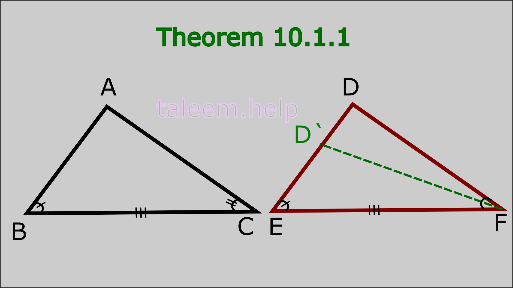
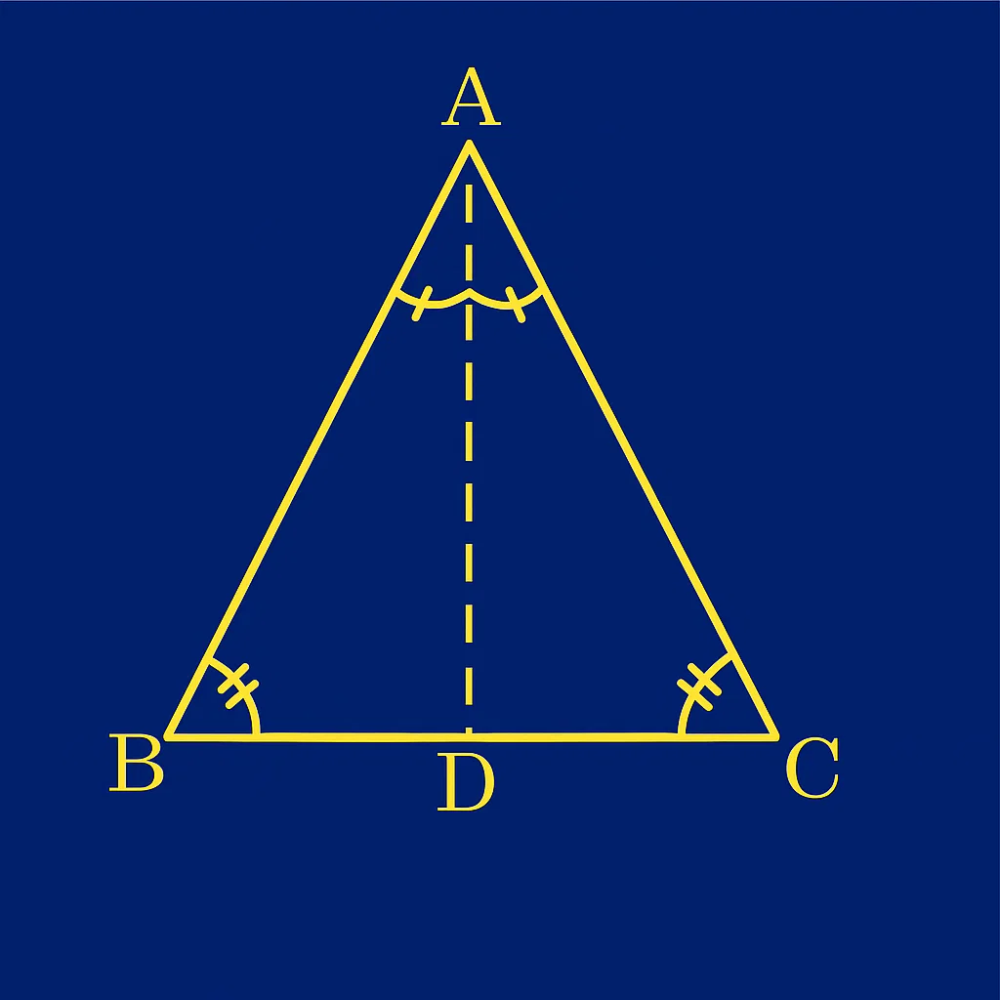
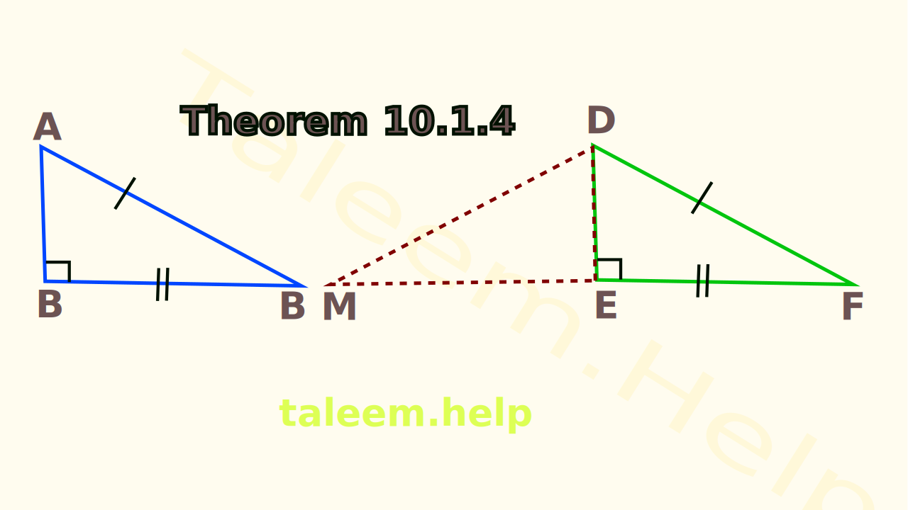
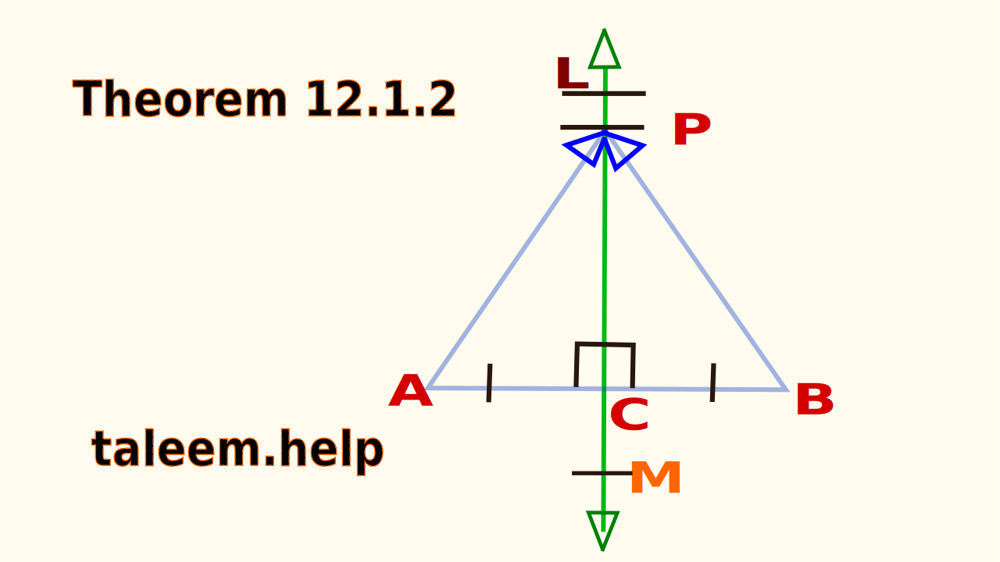
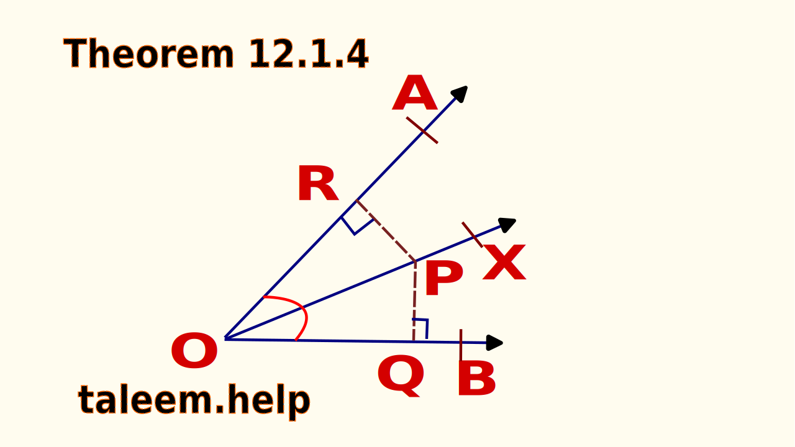
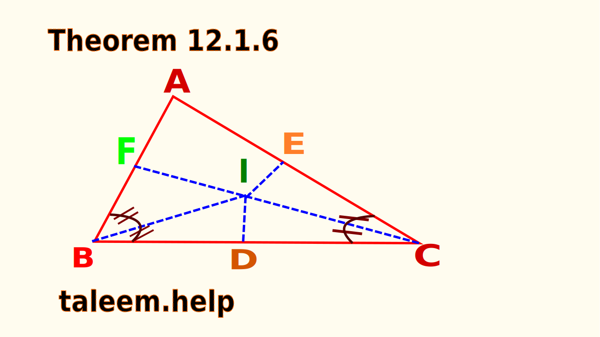

# Mathematics Class 9 (Federal/Punjab Board) – Selected Theorems (Chapters 10–12)
--------------------------------------------------------------------------------

**Theorem 10.1**  
If two angles and non-included side of one triangle are congruent to the corresponding angles and non-included side of another triangle, then two triangles are congruent.  

**Theorem 10.2**  
If two angles of a triangle are congruent, then the sides opposite to them are also congruent.  

**Theorem 10.3**  
In the correspondence of two triangles, if three sides of one triangle are congruent to the corresponding three sides of the other, the two triangles are congruent.  

**Theorem 10.4**  
If in the correspondence of two right-angled triangles, the hypotenuse and one side of one are respectively congruent to the hypotenuse and corresponding side of the other, the triangles are congruent.  

---

**Theorem 11.1**  
In a parallelogram: (i) Opposite sides are congruent; (ii) Opposite angles are congruent; (iii) Diagonals bisect each other.  

**Theorem 11.2**  
If two sides of a quadrilateral are congruent and parallel, it is a parallelogram.  

**Theorem 11.3**  
The line segment joining the midpoints of two sides of a triangle is parallel to the third side and equal to one-half of its length.  

**Theorem 11.4**  
The medians of a triangle are concurrent and their point of concurrency is the point of trisection of each median.  

**Theorem 11.5**  
If three or more parallel lines make congruent intercepts on a transversal, they also intercept congruent segments on the other line that cuts them.  

---

**Theorem 12.1**  
Any point on the right bisector of a line segment is equidistant from its end points.  

**Theorem 12.2**  
Any point equidistant from the end points of a line segment is on the right bisector of it.  

**Theorem 12.3**  
The right bisectors of the sides of the triangle are concurrent.  

**Theorem 12.4**  
Any point on the bisector of an angle is equidistant from its arms.  

**Theorem 12.5**  
Any point inside the angle, equidistant from its arms, is on its bisector.  

**Theorem 12.6**  
The bisectors of the angles of the triangle are concurrent.  

